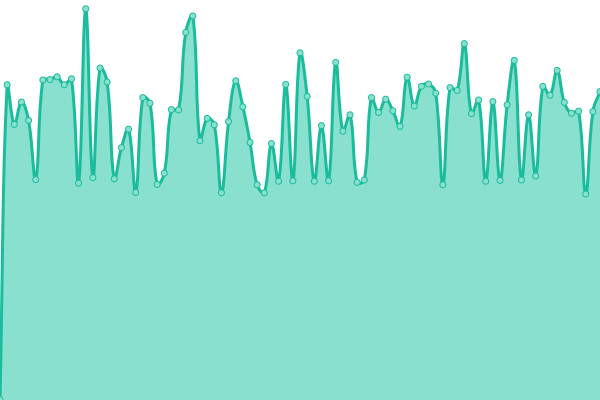

# [📈 Live Status](https://upptime.github.io/upptime): <!--live status--> **🟩 All systems operational**

This repository contains the open-source uptime monitor and status page for [Upptime](https://upptime.js.org), powered by [Upptime](https://github.com/upptime/upptime).

With [Upptime](https://upptime.js.org), you can get your own unlimited and free uptime monitor and status page, powered entirely by a GitHub repository. We use [Issues](https://github.com/upptime/upptime/issues) as incident reports, [Actions](https://github.com/upptime/upptime/actions) as uptime monitors, and [Pages](https://upptime.github.io/upptime) for the status page.

<!--start: status pages-->
<!-- This summary is generated by Upptime (https://github.com/upptime/upptime) -->
<!-- Do not edit this manually, your changes will be overwritten -->
<!-- prettier-ignore -->
| URL | Status | History | Response Time | Uptime |
| --- | ------ | ------- | ------------- | ------ |
|  [Google](https://www.google.com) | 🟩 Up | [google.yml](https://github.com/bitsstdcheee/luogu-status/commits/HEAD/history/google.yml) | 

 68ms
     
 | 

<a href="https://upptime.github.io/upptime/history/google">100.00%</a>
    

|  [Wikipedia](https://en.wikipedia.org) | 🟩 Up | [wikipedia.yml](https://github.com/bitsstdcheee/luogu-status/commits/HEAD/history/wikipedia.yml) | 

 378ms
     
 | 

<a href="https://upptime.github.io/upptime/history/wikipedia">100.00%</a>
    

|  [Luogu](https://www.luogu.com.cn) | 🟩 Up | [luogu.yml](https://github.com/bitsstdcheee/luogu-status/commits/HEAD/history/luogu.yml) | 

 1115ms
     
 | 

<a href="https://upptime.github.io/upptime/history/luogu">100.00%</a>
    

|  [Codeforces](https://codeforces.com) | 🟩 Up | [codeforces.yml](https://github.com/bitsstdcheee/luogu-status/commits/HEAD/history/codeforces.yml) | 

 309ms
     
 | 

<a href="https://upptime.github.io/upptime/history/codeforces">100.00%</a>
    

|  [HDU](http://acm.hdu.edu.cn) | 🟩 Up | [hdu.yml](https://github.com/bitsstdcheee/luogu-status/commits/HEAD/history/hdu.yml) | 

 1089ms
     
 | 

<a href="https://upptime.github.io/upptime/history/hdu">100.00%</a>
    

|  [VJudge](https://vjudge.net) | 🟩 Up | [v-judge.yml](https://github.com/bitsstdcheee/luogu-status/commits/HEAD/history/v-judge.yml) | 

 716ms
     
 | 

<a href="https://upptime.github.io/upptime/history/v-judge">100.00%</a>
    

|  [Github](https://github.com) | 🟩 Up | [github.yml](https://github.com/bitsstdcheee/luogu-status/commits/HEAD/history/github.yml) | 

 54ms
     
 | 

<a href="https://upptime.github.io/upptime/history/github">100.00%</a>
    

<!--end: status pages-->

[**Visit our status website →**](https://upptime.github.io/upptime)

## 📄 License

- Powered by: [Upptime](https://github.com/upptime/upptime)
- Code: [MIT](./LICENSE) © [Upptime](https://upptime.js.org)
- Data in the `./history` directory: [Open Database License](https://opendatacommons.org/licenses/odbl/1-0/)
