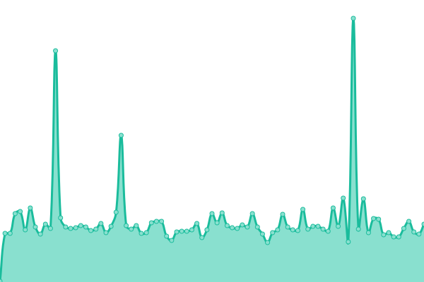
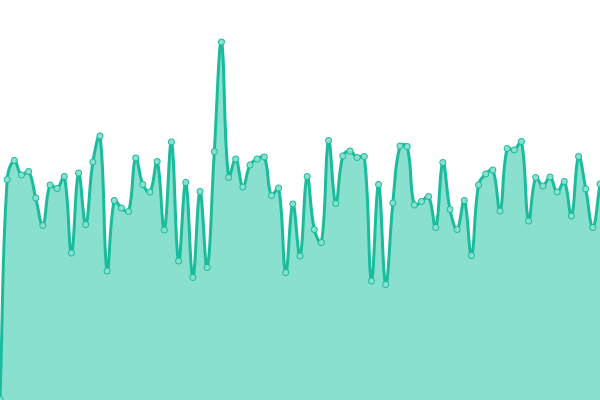

# [📈 Live Status](https://upptime.github.io/upptime): <!--live status--> **🟧 Partial outage**

This repository contains the open-source uptime monitor and status page for [Upptime](https://upptime.js.org), powered by [Upptime](https://github.com/upptime/upptime).

With [Upptime](https://upptime.js.org), you can get your own unlimited and free uptime monitor and status page, powered entirely by a GitHub repository. We use [Issues](https://github.com/upptime/upptime/issues) as incident reports, [Actions](https://github.com/bitsstdcheee/luogu-status/actions) as uptime monitors, and [Pages](https://upptime.github.io/upptime) for the status page.

<!--start: status pages-->
<!-- This summary is generated by Upptime (https://github.com/upptime/upptime) -->
<!-- Do not edit this manually, your changes will be overwritten -->
<!-- prettier-ignore -->
| URL | Status | History | Response Time | Uptime |
| --- | ------ | ------- | ------------- | ------ |
|  [Google](https://www.google.com) | 🟩 Up | [google.yml](https://github.com/bitsstdcheee/luogu-status/commits/HEAD/history/google.yml) | 

 99ms
     
 | 

<a href="https://bitsstdcheee.github.io/luogu-status/history/google">100.00%</a>
    

|  [Wikipedia](https://en.wikipedia.org) | 🟩 Up | [wikipedia.yml](https://github.com/bitsstdcheee/luogu-status/commits/HEAD/history/wikipedia.yml) | 

 183ms
     
 | 

<a href="https://bitsstdcheee.github.io/luogu-status/history/wikipedia">100.00%</a>
    

|  [Luogu](https://www.luogu.com.cn) | 🟩 Up | [luogu.yml](https://github.com/bitsstdcheee/luogu-status/commits/HEAD/history/luogu.yml) | 

 1461ms
     
 | 

<a href="https://bitsstdcheee.github.io/luogu-status/history/luogu">100.00%</a>
    

|  [Luogu CDN](https://cdn.luogu.com.cn/fe/loader.js?ver=20230228-2) | 🟩 Up | [luogu-cdn.yml](https://github.com/bitsstdcheee/luogu-status/commits/HEAD/history/luogu-cdn.yml) | 

 4316ms
     
 | 

<a href="https://bitsstdcheee.github.io/luogu-status/history/luogu-cdn">99.09%</a>
    

|  [Luogu Discuss](https://www.luogu.com.cn/discuss/lists) | 🟩 Up | [luogu-discuss.yml](https://github.com/bitsstdcheee/luogu-status/commits/HEAD/history/luogu-discuss.yml) | 

 499ms
     
 | 

<a href="https://bitsstdcheee.github.io/luogu-status/history/luogu-discuss">100.00%</a>
    

|  [Luogu Contest](https://www.luogu.com.cn/contest/list) | 🟩 Up | [luogu-contest.yml](https://github.com/bitsstdcheee/luogu-status/commits/HEAD/history/luogu-contest.yml) | 

 394ms
     
 | 

<a href="https://bitsstdcheee.github.io/luogu-status/history/luogu-contest">100.00%</a>
    

|  [Luogu Problem List](https://www.luogu.com.cn/problem/list) | 🟩 Up | [luogu-problem-list.yml](https://github.com/bitsstdcheee/luogu-status/commits/HEAD/history/luogu-problem-list.yml) | 

 571ms
     
 | 

<a href="https://bitsstdcheee.github.io/luogu-status/history/luogu-problem-list">100.00%</a>
    

|  [Luogu Ti](https://ti.luogu.com.cn/problemset) | 🟥 Down | [luogu-ti.yml](https://github.com/bitsstdcheee/luogu-status/commits/HEAD/history/luogu-ti.yml) | 

 2139ms
     
 | 

<a href="https://bitsstdcheee.github.io/luogu-status/history/luogu-ti">99.64%</a>
    

|  [Luogu Class](https://class.luogu.com.cn/course) | 🟩 Up | [luogu-class.yml](https://github.com/bitsstdcheee/luogu-status/commits/HEAD/history/luogu-class.yml) | 

 1519ms
     
 | 

<a href="https://bitsstdcheee.github.io/luogu-status/history/luogu-class">100.00%</a>
    

|  [Codeforces](https://codeforces.com) | 🟩 Up | [codeforces.yml](https://github.com/bitsstdcheee/luogu-status/commits/HEAD/history/codeforces.yml) | 

 684ms
     
 | 

<a href="https://bitsstdcheee.github.io/luogu-status/history/codeforces">99.85%</a>
    

|  [HDU](http://acm.hdu.edu.cn) | 🟩 Up | [hdu.yml](https://github.com/bitsstdcheee/luogu-status/commits/HEAD/history/hdu.yml) | 

 1347ms
     
 | 

<a href="https://bitsstdcheee.github.io/luogu-status/history/hdu">99.76%</a>
    

|  [VJudge](https://vjudge.net) | 🟩 Up | [v-judge.yml](https://github.com/bitsstdcheee/luogu-status/commits/HEAD/history/v-judge.yml) | 

 650ms
     
 | 

<a href="https://bitsstdcheee.github.io/luogu-status/history/v-judge">100.00%</a>
    

|  [Github](https://github.com) | 🟩 Up | [github.yml](https://github.com/bitsstdcheee/luogu-status/commits/HEAD/history/github.yml) | 

 186ms
     
 | 

<a href="https://bitsstdcheee.github.io/luogu-status/history/github">100.00%</a>
    

|  [AtCoder](https://atcoder.jp) | 🟩 Up | [at-coder.yml](https://github.com/bitsstdcheee/luogu-status/commits/HEAD/history/at-coder.yml) | 

 689ms
     
 | 

<a href="https://bitsstdcheee.github.io/luogu-status/history/at-coder">100.00%</a>
    

|  [UVA](https://onlinejudge.org) | 🟩 Up | [uva.yml](https://github.com/bitsstdcheee/luogu-status/commits/HEAD/history/uva.yml) | 

 831ms
     
 | 

<a href="https://bitsstdcheee.github.io/luogu-status/history/uva">100.00%</a>
    

|  [UVA Last 50 Submissions](https://onlinejudge.org/index.php?option=com_onlinejudge&Itemid=19) | 🟩 Up | [uva-last-50-submissions.yml](https://github.com/bitsstdcheee/luogu-status/commits/HEAD/history/uva-last-50-submissions.yml) | 

 576ms
     
 | 

<a href="https://bitsstdcheee.github.io/luogu-status/history/uva-last-50-submissions">100.00%</a>
    

<!--end: status pages-->

[**Visit our status website →**](https://upptime.github.io/upptime)

## 📄 License

- Powered by: [Upptime](https://github.com/upptime/upptime)
- Code: [MIT](./LICENSE) © [Upptime](https://upptime.js.org)
- Data in the `./history` directory: [Open Database License](https://opendatacommons.org/licenses/odbl/1-0/)
